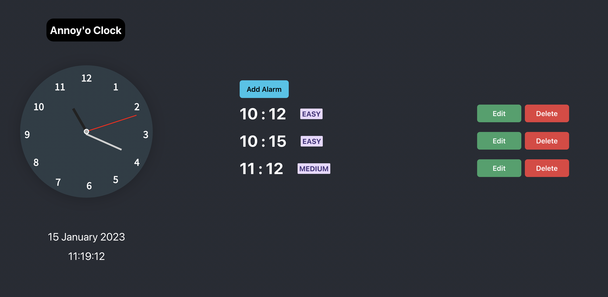

# Annoy'o Clock (#242 Team Mampos)

Taking a short nap? Want to be sure to wake up on time? Here's an alarm clock web app that makes you solve simple arithmetic problems in order to stop the alarm! NO snoozing allowed!!

## Getting Started 

In the project directory, you can run:

#### `npm start`

Runs the app in the development mode.\
Open [http://localhost:3000](http://localhost:3000) to view it in your browser.

## Functionalities 

### Add alarm 
Set a time to wake up, choose the difficulty of the math problem.

### Edit alarm 
Make changes to existing alarms.

### Delete alarm 
For those who want to wake up on their own.

Happy solving! :) 